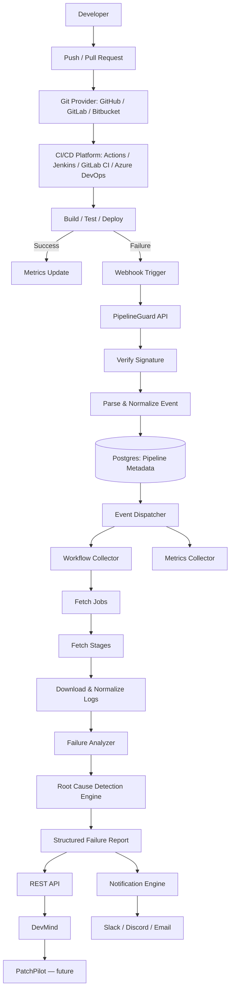
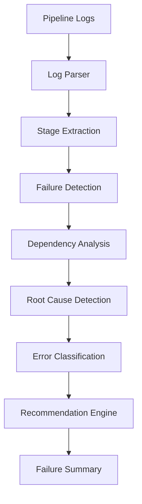
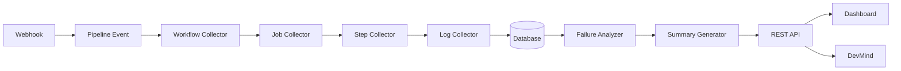
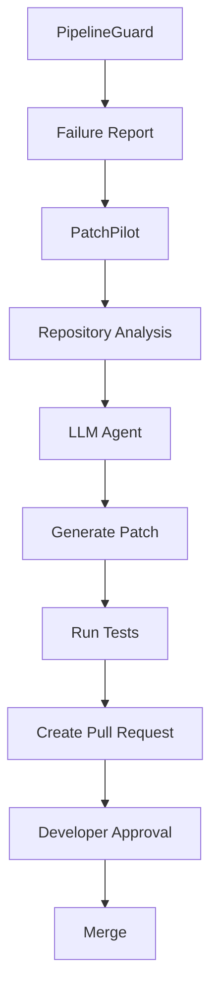

# PipelineGuard

**Automated CI/CD failure detection, root-cause analysis, and reporting engine — written in Go.**

PipelineGuard listens to CI/CD webhooks (GitHub Actions, GitLab CI, Jenkins, Azure DevOps, Bitbucket), pulls the failing workflow's logs, classifies *why* it failed, and surfaces a structured failure report via REST API + Slack/Discord/Email — instead of a developer manually scrolling through 2000 lines of CI logs.

It's designed as the **failure-intelligence layer** for [DevMind](#future-integration--devmind--patchpilot), a future multi-agent DevOps copilot that will auto-generate patches for known failure classes.

---

## Why this exists

Every CI/CD failure today means: open the pipeline → scroll logs → find the actual error → figure out root cause → fix → re-run. That loop wastes hours per week per team. PipelineGuard automates the "find + classify" part so humans (or eventually an AI agent) can jump straight to the fix.

---

## Architecture



---

## Event Lifecycle

```mermaid
flowchart LR
    A[Webhook Received] --> B[Authentication]
    B --> C[Payload Validation]
    C --> D[Provider Detection]
    D --> E[Normalize Event]
    E --> F[Fetch Workflow]
    F --> G[Fetch Jobs]
    G --> H[Fetch Steps]
    H --> I[Fetch Logs]
    I --> J[Store Logs]
    J --> K[Analyze Logs]
    K --> L[Detect Failed Stage]
    L --> M[Detect Root Cause]
    M --> N[Generate Summary]
    N --> O[Store Report]
    O --> P[Expose API]
    P --> Q[Notify User]
```



---

## Failure Analysis Engine



### Root Cause Categories

| Category | Example Trigger |
|---|---|
| Compilation Error | `go build` / `tsc` failure |
| Test Failure | assertion / unit test failure |
| Docker Build Failure | `Dockerfile` step error |
| Dependency Resolution Failure | `go.sum` / `package-lock` mismatch |
| Authentication Failure | invalid token / 401 from registry |
| Infrastructure Failure | runner OOM, disk full |
| Deployment Failure | rollout / helm apply error |
| Timeout | step exceeded max duration |
| Permission Denied | IAM / file permission errors |
| Resource Exhaustion | memory / CPU limits hit |
| Network Failure | DNS / connection refused |
| Unknown | fallback, unclassified |

Each category is designed to later feed **PatchPilot**, which will generate targeted fixes per category.

---

## Data Flow



---

## Tech Stack

| Layer | Choice |
|---|---|
| Language | Go |
| API | REST (net/http + chi/gin) |
| Storage | PostgreSQL (pipeline metadata), Redis (queue/cache) |
| Metrics | Prometheus + Grafana |
| Messaging (v3+) | Kafka |
| Notifications | Slack, Discord, Email |
| Deployment | Docker Compose → Kubernetes |
| CI providers | GitHub Actions (v1), GitLab CI / Jenkins (v2) |

## Project Structure

```
PipelineGuard/
├── cmd/server/          # entrypoint
├── configs/
├── internal/
│   ├── webhook/         # per-provider webhook receivers
│   ├── provider/        # per-provider API clients (interfaces.go = contract)
│   ├── collector/       # workflow/job/stage/log/artifact collectors
│   ├── analyzer/        # rootcause, stage, duration, dependency, summary
│   ├── parser/          # log format parsers per provider
│   ├── repository/      # postgres + redis
│   ├── notifier/        # slack/discord/email
│   ├── metrics/
│   ├── api/
│   ├── models/
│   └── config/
└── docker/
```

---

## Scalability Roadmap

- **v1** — GitHub Actions → REST API → PostgreSQL → Prometheus
- **v2** — + GitLab CI, Jenkins, Redis-backed queue
- **v3** — Kafka event bus, multiple consumers, distributed workers
- **v4** — Kubernetes, horizontal autoscaling, service mesh
- **v5** — AI integration → PatchPilot → DevMind

---

## Future Integration — DevMind + PatchPilot



Longer-term, PipelineGuard's failure summary feeds a full agent pipeline:

```mermaid
flowchart LR
    F[Pipeline Failure] --> PG[PipelineGuard]
    PG --> FS[Failure Summary]
    FS --> Orch[DevMind Orchestrator]
    Orch --> Plan[Planner Agent]
    Plan --> Repo[Repository Agent]
    Repo --> Patch[Patch Agent]
    Patch --> Val[Validation Agent]
    Val --> Docker[Docker Test Env]
    Docker --> PR[GitHub PR]
```



---

## Status

 Actively under development — GitHub Actions provider + core failure analyzer in progress.


Phase 1
──────────────
GitHub Webhook Receiver
Signature Verification
GitHub API Client
Workflow Fetcher
Log Downloader

Phase 2
──────────────
Log Parser
Stage Detector
Failure Detector

Phase 3
──────────────
Root Cause Engine
Failure Summary Generator
PostgreSQL Storage

Phase 4
──────────────
REST APIs
Search APIs

Phase 5
──────────────
Prometheus Metrics
Grafana Dashboards

Phase 6
──────────────
Slack Notifications
Discord Notifications
Email Notifications

Phase 7
──────────────
Redis Queue

Phase 8
──────────────
Kafka Event Bus

Phase 9
──────────────
DevMind Integration
PatchPilot Integration 
